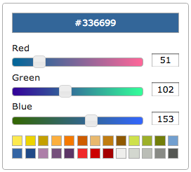

# jquery.ui.colorpicker

A basic color picker widget, created mainly as an experiment with CSS background
gradients.



## Usage

```
$('div').colorpicker();
```

will display the default widget which includes a color preview and sample
palette. The current color will default to black (0, 0, 0).

## Options

The `colorpicker` method accepts a single object parameter which can include
the following properties:

### value

An object with 3 properties - red, green. blue - representing the initial color
value. E.g.

```
value: { red: 0, green: 0, blue: 0 }
```

### show_preview

A boolean indicating whether or not to display the color preview


### palette

An object containing an example palette (NB This is not properly implemented
yet - see issue #1)

```
palette: {

    // Example palette - will need some methods to manage these

	tango: [
		'#FCE94F', '#EDD400', '#C4A000', '#FCAF3E', '#F57900', '#CE5C00',
		'#E9B96E', '#C17D11', '#8F5902', '#CEE14B', '#9DB029', '#727E0A',
		'#729FCF', '#3465A4', '#204A87', '#AD7FA8', '#75507B', '#5C3566',
		'#EF2929', '#CC0000', '#A40000', '#EEEEEC', '#D3D7CF', '#BABDB6',
		'#888A85', '#555753'
	]
}
```
